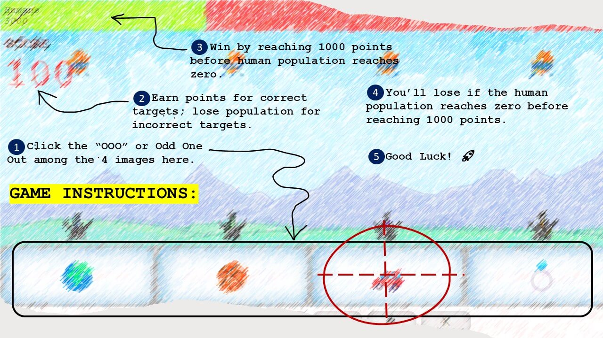

<!-- Improved compatibility of back to top link: See: https://github.com/othneildrew/Best-README-Template/pull/73 -->

<!-- PROJECT LOGO -->
 

<h1 align="center">OOO - Outsmarting Offworld Oppressors</h1>

  

    A browser game created using vanilla JS, HTML, and CSS.
     
    <a href="https://aramind.github.io/OOO---Outsmarting-Offworld-Oppressors-Game/" target="_blank" >OOO - Outsmarting Offworld Oppressors</a>
  

<!-- ABOUT THE PROJECT -->

## About The Project

This simple game application came to life during my immersive journey in the web development bootcamp. It serves as a testament to my progress while mastering the fundamentals of HTML, CSS, and JavaScript. Given my almost zero knowledge yet to various frameworks, the entirety of this game app's functionalities, features, and styling were meticulously crafted using pure JavaScript code, vanilla CSS, and, of course, the reliable foundations of HTML.

The primary aim of this project was twofold: to gain hands-on experience in developing a game application and to apply and reinforce the knowledge and skills I had acquired throughout my intensive JavaScript training. Through this undertaking, I delved deeper into the intricacies of JavaScript programming, further solidifying my understanding of its core concepts and reinforcing my problem-solving abilities.

By immersing myself in this project, I honed my expertise in building interactive user interfaces, implementing game logic, and ensuring a seamless user experience. This app showcases my dedication and commitment to self-improvement, as I leveraged my newfound skills to create an entertaining and engaging gaming experience.

Embarking on this endeavor not only deepened my understanding of JavaScript but also nurtured more my passion for creating using codes.

### Built With

- HTML5
- CSS3
- Javascript

## License

Distributed under the MIT License. See `LICENSE.txt` for more information.

(<a href="#readme-top">back to top</a>)

